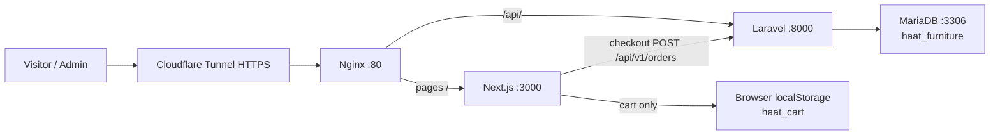

# HAAT Furniture Limited — Project Documentation

Internal technical documentation for the live storefront at **https://haat.barabdonline.com**.

Last reviewed: 19 August 2026.

---

## 1. Short summary (বাংলা)

HAAT Furniture Limited-এর অনলাইন শপ। কাস্টমার সাইট থেকে আসবাব দেখে কার্টে রাখে, চেকআউট করে অর্ডার দেয়। অর্ডার, প্রোডাক্ট, ক্যাটাগরি আর ব্যানার **MariaDB** ডাটাবেজে সেভ হয়। অ্যাডমিন প্যানেল থেকে প্রোডাক্ট/অর্ডার/ব্যানার ম্যানেজ করা যায়।

| অংশ | কী করে |
|---|---|
| Next.js (পোর্ট 3000) | ওয়েবসাইট UI — হোম, ক্যাটালগ, চেকআউট, অ্যাডমিন |
| Laravel (পোর্ট 8000) | `/api/` — প্রোডাক্ট, অর্ডার, ক্যাটাগরি, ব্যানার |
| MariaDB (পোর্ট 3306) | লাইভ ডাটাবেজ `haat_furniture` |
| Nginx | পাবলিক ট্রাফিক ভাগ করে: পেজ → Next.js, API → Laravel |
| Cloudflare Tunnel | HTTPS ডোমেইন `haat.barabdonline.com` |
| PM2 | তিনটা প্রসেস চালিয়ে রাখে: frontend, backend, MariaDB |

---

## 2. Live URLs

| Page | URL |
|---|---|
| Homepage | https://haat.barabdonline.com |
| Catalog | https://haat.barabdonline.com/products |
| Product | https://haat.barabdonline.com/product/{id} |
| Category | https://haat.barabdonline.com/product-category/{slug} |
| Checkout | https://haat.barabdonline.com/checkout |
| Admin | https://haat.barabdonline.com/admin |
| About | https://haat.barabdonline.com/about-us |
| Terms | https://haat.barabdonline.com/terms-conditions |
| Privacy | https://haat.barabdonline.com/privacy-policy |
| Refund | https://haat.barabdonline.com/refund-returns-policy |
| Products API | https://haat.barabdonline.com/api/v1/products |
| Orders API | https://haat.barabdonline.com/api/v1/orders |

---

## 3. Architecture



Request path:

1. Browser hits `haat.barabdonline.com`.
2. Cloudflare Tunnel forwards to this Ubuntu VM (`Frontend-server`, `10.111.47.20`).
3. Nginx:
   - `/` → `http://127.0.0.1:3000` (Next.js)
   - `/api/` → `http://127.0.0.1:8000/api/` (Laravel)
4. Laravel reads/writes MariaDB.
5. Cart stays in the browser until checkout. Checkout writes an order row in MySQL.

Nginx vhost: `/etc/nginx/sites-available/haat-furniture`.

---

## 4. Repository layout

Root: `/home/barabd/haat-furniture-v2`

```
haat-furniture-v2/
├── frontend/                 Next.js 16 storefront + admin UI
│   ├── src/app/              Pages and a few leftover Next API routes
│   ├── public/               Logo, cursor, uploads
│   └── package.json
├── backend/                  Laravel 12 API
│   ├── app/Http/Controllers/Api/
│   ├── app/Models/
│   ├── database/migrations/
│   ├── database/seeders/HaatCatalogSeeder.php
│   ├── routes/api.php
│   ├── bin/php-with-mysql    PHP wrapper that loads pdo_mysql
│   ├── scripts/              MariaDB start / install helpers
│   └── storage/mariadb/      User-space MariaDB data + binaries
├── imported_wp_products.json Legacy WordPress import (seed source)
├── DOCUMENTATION.md          This file
└── README.md
```

---

## 5. Technology stack

| Layer | Choice |
|---|---|
| Frontend | Next.js **16.3.1**, React **19**, Tailwind CSS **4**, App Router |
| Backend | Laravel **12**, PHP **8.3** |
| Database | MariaDB **10.11** (Laravel `DB_CONNECTION=mysql`) |
| Process manager | PM2 |
| Reverse proxy | Nginx |
| Public HTTPS | Cloudflare Tunnel (`cloudflared`) |
| OS | Ubuntu 24.04, user `barabd` |
| Design | Cream / gold / teak (`#fbf9f5`, `#c59b27`, `#1b120c`) |

Brand copy: **100% solid Chittagong Segun teak**, **5-year service warranty** (manufacturing fault). Showrooms: Badda & Mirpur. Hotline: **+8809617333990**. WhatsApp: `https://wa.me/8809617333990`.

---

## 6. Storefront pages

All main UI files live under `frontend/src/app/`.

| Route | File | Notes |
|---|---|---|
| `/` | `page.js` | Hero, banners from API, category showcase, product sliders, cart drawer |
| `/products` | `products/page.js` | Full catalog; loads `/api/v1/products` (JSON fallback) |
| `/product/[id]` | `product/[id]/page.js` | Gallery zoom, add to cart, cart drawer |
| `/product-category/[...slug]` | `product-category/[...slug]/page.js` | Nested category tree + filters |
| `/checkout` | `checkout/page.js` | Address, coupon, payment, POST order |
| `/admin` | `admin/page.js` | Role-based dashboard (client-side login) |
| `/about-us` | `about-us/page.js` | Company page |
| `/terms-conditions` | `terms-conditions/page.js` | Includes 5-year warranty terms |
| `/privacy-policy` | `privacy-policy/page.js` | Policy |
| `/refund-returns-policy` | `refund-returns-policy/page.js` | Refund / 20% cancel fee policy |

### Cart

- Header **Cart** opens a right-side drawer (z-index above the sticky header).
- Items are stored in `localStorage` key **`haat_cart`**.
- Quantity +/- and remove work in the drawer.
- **Proceed to Checkout** goes to `/checkout`.
- **Checkout via WhatsApp** opens a pre-filled WhatsApp message.
- Cart is **not** stored in MariaDB. Only confirmed orders are.

### Checkout rules

- Required: first name, 11-digit BD phone (`01XXXXXXXXX`), street address.
- Shipping: **৳60 Dhaka**, **৳150 outside Dhaka**.
- Coupon **HAAT10** or **discount** → 10% off product subtotal.
- Payment: COD, bKash, Nagad (TrxID required), WhatsApp.
- bKash/Nagad send-money number in UI: **01957909186**.
- Successful POST `/api/v1/orders` inserts into MariaDB `orders` (id like `HF-######`).
- Admin polls `/api/v1/orders` about every 8 seconds.

### Warranty / policy (as shown on site)

- **5 years** free service warranty for manufacturing fault.
- No warranty on glass, fabric, rexin, lock, light, handle, knob.
- Bring purchase voucher + warranty card for service.
- ~20% cancel fee and 15–20 day delivery language remain on policy pages where written.

---

## 7. Admin panel

URL: `/admin`. Login is **server-side**: `POST /api/v1/admin/login`. Credentials live in `backend/.env` (`HAAT_ADMIN_*`). Frontend no longer embeds passwords.

After login the browser stores a 12-hour encrypted token (`haat_admin_token`) and sends `Authorization: Bearer …` on orders / product writes / banner publish.

Same usernames as before (`sudoadmin`, `adminmanager`, `viewonly`). After this change, log in again (old localStorage session is not enough).

| Username | Role | Can do |
|---|---|---|
| `sudoadmin` | sudo | All tabs, including bulk discount and audit log |
| `adminmanager` | admin | Products, orders, categories, banners, inquiries — no bulk discount |
| `viewonly` | view | Products, orders, analytics, inquiries — read mostly |

Passwords are in `backend/.env` (`HAAT_ADMIN_*_PASS`). Avoid `#` in passwords (dotenv comment). After changing, `php artisan config:clear` and `pm2 restart haat-backend`. Client logins: `HANDOVER.md` + the handover message.

Tabs: products, add/edit product, orders, categories, analytics, bulk discount (sudo), banners, inquiries, audit log.

- Product create/update/delete → Laravel `/api/v1/products` → MariaDB.
- Banners GET/PUT → `/api/v1/banners` → `site_settings`.
- Orders list → `/api/v1/orders`. Status change → `PUT /api/v1/orders` `{id, status}`.
- Categories GET/POST/PUT/DELETE → `/api/v1/categories` → MariaDB.
- Bulk discount (sudo) → `POST /api/v1/products/bulk-discount` `{percent, category}` writes new prices + `old_price`.
- Audit log is **browser `localStorage`** (`haat_admin_audit_logs`).
- Image upload → Laravel `POST /api/v1/upload` (admin write token, field `file`) → `frontend/storage/uploads/` → public URL `/uploads/{filename}` (Next.js route; files added after build still work).

---

## 8. API reference

Public `/api/` is Laravel. Response shape is usually `{ success, data }` or `{ success, count, data }`.

| Method | Path | Purpose |
|---|---|---|
| POST | `/api/v1/admin/login` | Admin login → token |
| GET | `/api/v1/admin/me` | Current admin (Bearer) |
| GET | `/api/v1/products` | List products. Query: `category`, `search` |
| GET | `/api/v1/products/{id}` | One product |
| POST | `/api/v1/products` | Create (admin write token) |
| PUT | `/api/v1/products` | Update; body must include `id` (admin write) |
| DELETE | `/api/v1/products?id=` or `/api/v1/products/{id}` | Delete (admin write) |
| POST | `/api/v1/products/bulk-discount` | Sudo only. Body `{percent: 1–50, category: slug|all}` |
| GET | `/api/v1/categories` | Category list with item counts |
| POST | `/api/v1/categories` | Create category (admin write) |
| PUT | `/api/v1/categories` | Update category; body includes `id` (admin write) |
| DELETE | `/api/v1/categories?id=` or `/api/v1/categories/{id}` | Delete (admin write) |
| GET | `/api/v1/orders` | Latest 500 orders (admin token) |
| POST | `/api/v1/orders` | Place order (`customer`, `phone`, `line_items` required; totals from DB) |
| PUT | `/api/v1/orders` | Update status `{id, status}` (admin write) |
| GET | `/api/v1/banners` | Homepage hero offer + slides |
| PUT | `/api/v1/banners` | Publish banners (admin write) |
| POST | `/api/v1/upload` | Image upload, field `file` (admin write). Returns `{url}` |

Product JSON fields returned to the storefront:

`id`, `name`, `slug`, `category`, `category_slug`, `price`, `oldPrice`, `old_price`, `rating`, `reviews`, `image`, `badge`, `description`, `categories[]`, `category_names[]`, `gallery[]`, `wood_type`, `warranty`.

Order JSON fields: `id`, `customer`, `phone`, `email`, `address`, `items`, `total`, `subtotal`, `shipping`, `discount`, `status`, `date`, `payment`, `source`, `createdAt`.

Next.js still has unused file-based copies under `frontend/src/app/api/v1/{products,orders,banners}` — Nginx never reaches them for public `/api/`.

---

## 9. Database (MariaDB)

This is **not** system `apt` MariaDB. It runs as the `barabd` user from project files, registered in PM2 as `haat-mariadb`.

| Setting | Value |
|---|---|
| Engine | MariaDB 10.11 (MySQL-compatible) |
| Host | `127.0.0.1` |
| Port | `3306` (localhost only) |
| Database | `haat_furniture` |
| Username | `haat_app` |
| Password | `backend/.env` → `DB_PASSWORD` |
| Socket | `backend/storage/mariadb/mysql.sock` |
| Data dir | `backend/storage/mariadb/data` |
| Client binary | `backend/storage/mariadb/prefix/usr/bin/mariadb` |

Laravel `.env` uses `DB_CONNECTION=mysql`. PHP does not have distro `php8.3-mysql` installed; `backend/bin/php-with-mysql` loads `pdo_mysql` from the extracted extension folder via `PHP_INI_SCAN_DIR`.

### Shop tables

**`products`** — catalog (seeded ~128 rows from WordPress export).

| Column | Type |
|---|---|
| id | unsigned bigint, primary (WordPress id or timestamp) |
| name, slug | string |
| category, category_slug | string |
| price, old_price | decimal(12,2) |
| rating, reviews | decimal / int |
| image | varchar 1024 |
| badge, wood_type, warranty | string |
| description | longtext |
| categories, category_names, gallery | JSON arrays |

**`categories`** — id, name, unique slug, count (`"N Items"`), optional icon.

**`orders`** — string primary id (`HF-924332`), customer, phone, email, address, items (text), totals, status, order_date, payment, source.

**`site_settings`** — key/value JSON. Key `banners` holds `heroOffer` + `heroSlides`.

Laravel also has `users`, `sessions`, `cache`, `jobs`, `migrations`, `personal_access_tokens` (framework defaults). Shop admin users are **not** in `users`.

### Seed

`backend/database/seeders/HaatCatalogSeeder.php` loads:

- `frontend/src/app/products_128_data.json` → products
- `imported_wp_products.json` → categories + slugs
- `backend/storage/app/haat-orders.json` → orders (backup mirror)
- `frontend/src/app/site-banners.json` → banners

New orders are also mirrored back to `haat-orders.json` after insert.

**Re-seed wipes catalog/order rows.** Do not run `php artisan migrate:fresh --seed` on production unless that is intended.

---

## 10. How to open the database (MobaXterm / SSH)

```bash
cd /home/barabd/haat-furniture-v2/backend
PASS=$(grep '^DB_PASSWORD=' .env | cut -d= -f2-)
./storage/mariadb/prefix/usr/bin/mariadb -h 127.0.0.1 -P 3306 -u haat_app -p"$PASS" haat_furniture
```

Useful SQL:

```sql
SHOW TABLES;
SELECT COUNT(*) FROM products;
SELECT id, name, price FROM products LIMIT 10;
SELECT id, customer, phone, total, status FROM orders;
SELECT id, name, slug, count FROM categories;
```

One-shot without interactive login:

```bash
./storage/mariadb/prefix/usr/bin/mariadb -h 127.0.0.1 -P 3306 -u haat_app -p"$PASS" haat_furniture -e "SELECT id, customer, total, status FROM orders;"
```

---

## 11. PM2 processes

| Name | What it runs |
|---|---|
| `haat-frontend` | `npm start -- -p 3000` in `frontend/` |
| `haat-backend` | `./bin/php-with-mysql artisan serve --host=0.0.0.0 --port=8000` in `backend/` |
| `haat-mariadb` | `backend/scripts/run-mariadbd.sh` — starts MariaDB or waits if already up |

```bash
pm2 list
pm2 logs haat-backend --lines 50
pm2 restart haat-frontend
pm2 restart haat-backend
pm2 save
```

After **frontend visual/JS changes**:

```bash
cd /home/barabd/haat-furniture-v2/frontend
npm run build
pm2 restart haat-frontend
```

Hard refresh in the browser: **Ctrl+Shift+R**.

After **Laravel PHP changes**, restart `haat-backend` (artisan serve reloads many files, but restart is safer).

---

## 12. Data flow cheat sheet

| Data | Where it lives | Written by |
|---|---|---|
| Products | MariaDB `products` | Admin POST/PUT/DELETE + seeder |
| Categories | MariaDB `categories` | Admin POST/PUT/DELETE; counts refresh on product change |
| Orders | MariaDB `orders` (+ JSON mirror) | Checkout POST; admin PUT status |
| Banners | MariaDB `site_settings` | Admin PUT |
| Cart | Browser `localStorage haat_cart` | Storefront JS |
| Admin session | `localStorage haat_admin_token` (12h) | `POST /api/v1/admin/login` |
| Audit log | Browser `localStorage haat_admin_audit_logs` | Admin JS |
| Product images | Remote URLs and `/uploads/` files | Laravel upload → `frontend/storage/uploads` |

---

## 13. Business / content notes

- Company name in UI: **HAAT Furniture Limited** / **HAAT FURNITURE LIMITED**.
- Theme: cream background, gold accents, teak browns — avoid heavy black UI.
- Custom wood-chip cursor: `frontend/public/images/wood-cursor-v2.png`.
- Catalog originally imported from WordPress (`imported_wp_products.json` + richer `products_128_data.json`).
- Homepage **Admin** link is a small text control, not a dark pill.

---

## 14. Known limitations

1. Cart is device-local; clearing browser data empties the cart.
2. Inquiries tab is sample data (not a live contact-form inbox).
3. `/products` catalog page has no add-to-cart (homepage + product page do).
4. MariaDB is a user-space install (no `sudo apt` package). It depends on PM2 `haat-mariadb` and files under `backend/storage/mariadb/`. A reboot is covered if `pm2 startup` + `pm2 save` are configured.
5. Duplicate Nginx vhosts (`frontend` + `haat-furniture`) both use `server_name _` (P2).
6. No automated tests covering shop APIs.

Optional later upgrade: install distro `mariadb-server` + `php8.3-mysql` with `sudo bash backend/scripts/setup-mysql.sh`.

---

## 15. Quick incident checks

Site down?

```bash
pm2 list
curl -sS -o /dev/null -w '%{http_code}\n' http://127.0.0.1:3000/
curl -sS http://127.0.0.1:8000/api/v1/products | head
ss -ltn | grep -E ':3000|:8000|:3306'
```

API 500 “could not find driver”? Backend must start through `./bin/php-with-mysql`, not plain `php artisan serve`.

Database empty after a mistake? Restore from JSON + seeder only if overwriting live orders is acceptable:

```bash
cd /home/barabd/haat-furniture-v2/backend
./bin/php-with-mysql artisan db:seed --force
```

---

## 16. File map (backend API)

| File | Role |
|---|---|
| `backend/routes/api.php` | All v1 routes |
| `backend/app/Http/Controllers/Api/ProductController.php` | Product CRUD |
| `backend/app/Http/Controllers/Api/OrderController.php` | Order list/create |
| `backend/app/Http/Controllers/Api/CategoryController.php` | Category list |
| `backend/app/Http/Controllers/Api/BannerController.php` | Banner get/update |
| `backend/app/Models/Product.php` | Product model + API array |
| `backend/database/seeders/HaatCatalogSeeder.php` | Initial data |

---

Developed for **HAAT Furniture Limited**. Code path: `/home/barabd/haat-furniture-v2`.
